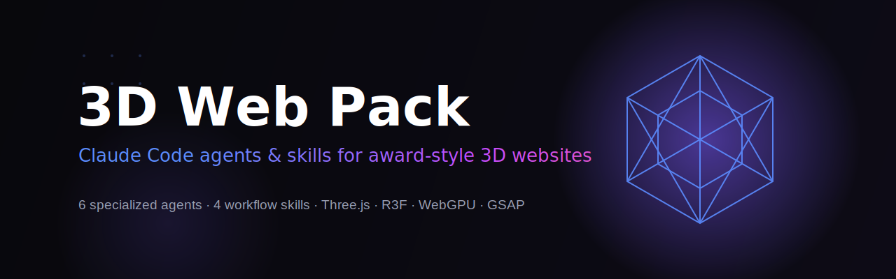

<div align="center">



### The Claude Code pack for building **award-style 3D websites** — end to end.

[](LICENSE)
[](#-agents)
[](#-skills)
[](https://docs.claude.com/en/docs/claude-code)
[](https://threejs.org)
[](https://skinnye.github.io/3d-web-pack/)

[**Live demo**](https://skinnye.github.io/3d-web-pack/) · [Agents](#-agents) · [Skills](#-skills) · [Stack](#-recommended-stack-2026) · [Install](#-installation)

</div>

> [!NOTE]
> Six specialized agents and four guided skills that take a 3D web project from **architecture → scene code → shaders → motion → performance → assets**, all wired into Claude Code. The landing page in this repo is itself built with the pack (Three.js + custom shaders + GSAP). The pack and the demo are independent — install just the `agents/` and `skills/`.

---

## 📋 Table of contents

- [What's inside](#-whats-inside)
- [Installation](#-installation)
- [Agents](#-agents)
- [Skills](#-skills)
- [Recommended stack (2026)](#-recommended-stack-2026)
- [AI 3D asset tools](#-ai-3d-asset-tools)
- [Typical workflow](#-typical-workflow)
- [How a pack file is structured](#-how-a-pack-file-is-structured)
- [Repository layout](#-repository-layout)
- [Contributing](#-contributing)
- [License](#-license)

---

## 📦 What's inside

| Component | Count | Purpose |
| :--- | ---: | :--- |
| **Agents** | 6 | Specialized subagents, one per layer of a 3D site |
| **Skills** | 4 | One-command guided workflows |
| **Demo site** | 1 | A live, shader-driven landing page built with the pack |
| **Guide** | 1 | [`3D-WEB-PACK.md`](3D-WEB-PACK.md) — full reference (RU) |

---

## 🚀 Installation

Agents and skills live in your **global** `~/.claude` directory, so they work in *every* project.

**Manual (recommended):**

```bash
# 1. clone
git clone https://github.com/skinnye/3d-web-pack.git

# 2. copy agents + skills into your global Claude Code config
#    macOS / Linux:
cp -r 3d-web-pack/agents/*  ~/.claude/agents/
cp -r 3d-web-pack/skills/*  ~/.claude/skills/
```

```powershell
# Windows (PowerShell):
Copy-Item 3d-web-pack/agents/* $HOME/.claude/agents/ -Recurse
Copy-Item 3d-web-pack/skills/* $HOME/.claude/skills/ -Recurse
```

**Project-scoped (this repo only):** copy into `<project>/.claude/agents` and `<project>/.claude/skills` instead.

Then just describe what you want — agents trigger automatically by task, or call them by name. Skills run as `/skill-name`.

---

## 🤖 Agents

Each agent owns one layer of a high-end 3D site. They hand off to one another automatically.

| Agent | Owns | Reach for it when… |
| :--- | :--- | :--- |
| [**threejs-architect**](agents/threejs-architect.md) | Planning, stack choice, scene graph, FPS/asset budgets | Starting a new site or scoping a 3D feature |
| [**r3f-engineer**](agents/r3f-engineer.md) | React Three Fiber / Three.js scene code, drei, model loading | You need to actually build the scene |
| [**shader-artist**](agents/shader-artist.md) | GLSL & TSL (WebGPU) shaders, custom materials, effects | "Make it look like…", glow, distortion, particles |
| [**motion-choreographer**](agents/motion-choreographer.md) | GSAP ScrollTrigger, Lenis, camera choreography | Scroll storytelling, animation, interaction |
| [**webgl-perf-auditor**](agents/webgl-perf-auditor.md) | Draw calls, instancing, LOD, compression, memory, mobile | It stutters, lags, or drains battery |
| [**asset-pipeline-engineer**](agents/asset-pipeline-engineer.md) | glTF/GLB optimization, Draco, KTX2, gltfjsx, AI assets | Preparing, compressing, or wiring up models |

---

## 🛠 Skills

| Skill | What it does |
| :--- | :--- |
| [`/scaffold-3d-site`](skills/scaffold-3d-site/SKILL.md) | Scaffold a fresh project — Vite/Next + R3F + drei + postprocessing + motion |
| [`/optimize-3d-assets`](skills/optimize-3d-assets/SKILL.md) | Compress models & textures (gltf-transform, gltfpack, Draco, KTX2), gltfjsx |
| [`/add-postprocessing`](skills/add-postprocessing/SKILL.md) | Cinematic bloom, depth-of-field, grain, tone-mapping for an R3F scene |
| [`/scroll-3d-scene`](skills/scroll-3d-scene/SKILL.md) | Scroll-driven 3D with Lenis + GSAP, or in-canvas drei ScrollControls |

---

## 🧱 Recommended stack (2026)

| Layer | Tools |
| :--- | :--- |
| **Render** | React Three Fiber + drei · Three.js · WebGPU + TSL · Babylon.js |
| **Motion** | GSAP + ScrollTrigger · Lenis · react-spring · theatre.js |
| **Look** | @react-three/postprocessing · custom GLSL/TSL · HDRI · leva |
| **Assets** | gltf-transform · gltfpack · Draco · KTX2/Basis |
| **Perf** | instancing · LOD · `frameloop="demand"` · stats-gl · r3f-perf |

> **WebGPU** reached *Baseline* across all major browsers in January 2026 — for new builds, target Three.js `WebGPURenderer` + **TSL**, with automatic WebGL2 fallback.

---

## 🎨 AI 3D asset tools

| Tool | Strength |
| :--- | :--- |
| **Meshy AI** | Best PBR textures, auto-rigging, 500+ animation presets |
| **Tripo AI** | Fastest generation (~8s), clean production-ready meshes |
| **Rodin / Hyper3D** | High-detail models |
| **Spline** | Scene generation + visual editor + web export |
| **Poly Haven** | Free CC0 HDRIs, textures, models |

Treat any AI output as raw input — always run it through `/optimize-3d-assets` before shipping.

---

## 🔄 Typical workflow

```text
1. threejs-architect      →  plan stack, architecture, budgets
2. /scaffold-3d-site      →  fresh project
3. r3f-engineer           →  build the scene
4. asset-pipeline-engineer + /optimize-3d-assets  →  real models, web-ready
5. shader-artist + /add-postprocessing            →  the look
6. motion-choreographer + /scroll-3d-scene        →  motion
7. webgl-perf-auditor     →  lock 60fps on mobile
```

---

## 🧩 How a pack file is structured

**Agent** (`agents/<name>.md`):

```markdown
---
name: shader-artist
description: When this agent should be invoked…
tools: Read, Write, Edit, Glob, Grep, WebSearch, WebFetch
---

System prompt: role, rules, techniques, output format.
```

**Skill** (`skills/<name>/SKILL.md`):

```markdown
---
name: scaffold-3d-site
description: What it does and when to use it…
---

Step-by-step procedure the model follows.
```

---

## 🗂 Repository layout

```text
3d-web-pack/
├─ index.html            # live demo (Three.js + shaders + GSAP)
├─ assets/
│  ├─ main.js            # WebGL scene + scroll choreography
│  ├─ style.css
│  └─ banner.svg
├─ agents/               # ← the 6 agents (install these)
│  ├─ threejs-architect.md
│  ├─ r3f-engineer.md
│  ├─ shader-artist.md
│  ├─ motion-choreographer.md
│  ├─ webgl-perf-auditor.md
│  └─ asset-pipeline-engineer.md
├─ skills/               # ← the 4 skills (install these)
│  ├─ scaffold-3d-site/SKILL.md
│  ├─ optimize-3d-assets/SKILL.md
│  ├─ add-postprocessing/SKILL.md
│  └─ scroll-3d-scene/SKILL.md
├─ 3D-WEB-PACK.md        # full guide (RU)
├─ README.md
└─ LICENSE
```

---

## 🤝 Contributing

PRs welcome — add an agent or skill, improve a prompt, or extend the stack guidance. Keep agent descriptions specific (they drive auto-selection) and skills procedural.

## 📄 License

[MIT](LICENSE) — use it, fork it, ship cool 3D sites.

<div align="center">
<sub>Built with Three.js, GSAP & the pack itself.</sub>
</div>
